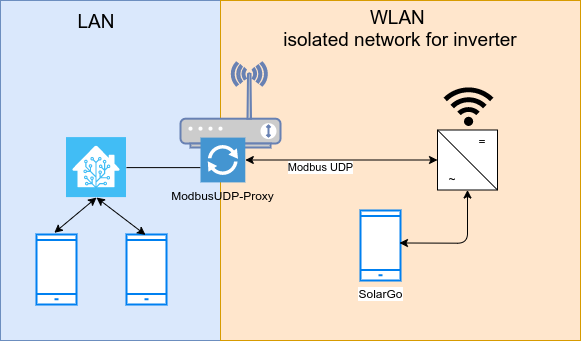

# Modbus UDP Proxy

A Goodwe Inverter has serveral sever security issue so it is not a good idea to connect it to the internet or LAN. This project provide a Modbus UDP Proxy which filters and forward requests.

## Licence
- MIT License

## Goodwe Inverter Security Issues

- The web interface has hardcoded credentials which are not changeable.
- The inverter can be configured with the SolarGo/PVMaster app without any working security policy. Also the Goodwe integration of Home Assistant can configure the inverter without any password.

## Features 
- Forward Modbus UDP requests to a device and send response back.
- Allow only read requests (0xF7,0x03). All other packets are dropped.

## Setup
- Setup a isolated wireless network which is not routed or masquerated.
    - Connect the Goodwe inverter the isolated wireless network with a static IP address.
- Install micropython 
- Start `modbus-udp-proxy.py <localPort> <remoteHost> <remotePort> <verbose on|off, optional>`
    -  `remoteHost`: ip address of the inverter
    - `localport` port for Modbus UDP, typically 8899
    - `remotePort` port for Modbus UDP, typically 8899
- Connect the Home Assistant Goodwe integration to the LAN ip address of the modbus UDP proxy

### Tested Environment
- Goodwe GW10k-ET
- TP-Link Archer C7 with OpenWRT 22.03 with Micropython 1.18
- Home Assistant running in a docker container
- The inverter can be configured if a smartphone with the SolarGo App is connected also to the isolated network.
- All networks are using IPv4 with static address configuration.
